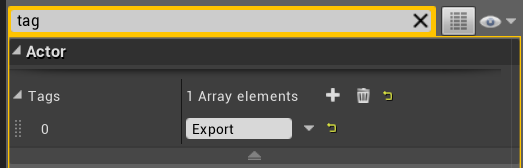
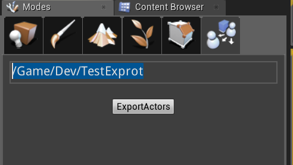
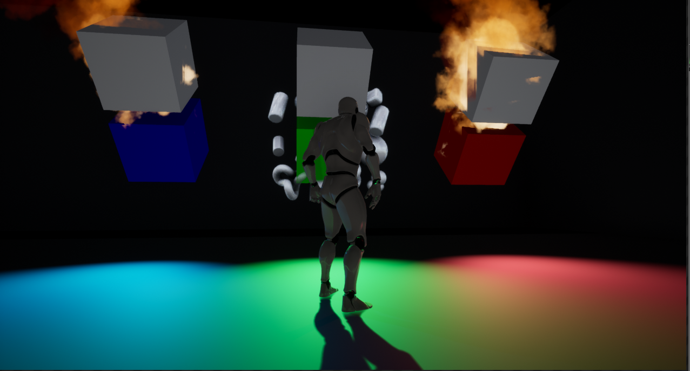

# UE4-微端实现基础(一)

## 场景内的资源

​	实现微端其中的一个环节,就是需要把场景内的资源进行下载,加载,由于和直接生成的资源相比,场景内的资源可能是被编辑过的,它不同于直接通过`CDO`创建出来的对象,对象内部的`Property`和`Dependence`往往各不相同,所以第一步,要先把场景内的`Actor`信息,保存下来.

​	在看`UE`内关于`ULevel`创建的那部分代码的时候,发现`ULeve`内部保存了所有的这个`Level`上的`Actor`的信息.通过`Serialize`逐一的创建出来,所以,可以仿照`ULevel`的做法,把所有要参与微端的`Actor`的信息保存到一个`Asset`内部,等游戏运行的时候,根据这个`Asset`内部存储的`Actor`信息,把他们创建出来,创建之前,先查询每个`Actor`所需的`Dependence`,把这些依赖下载完后以后并且`Mount`之后,我们就可以把这个`Actor`序列化出来,目前能想到的就是这么个流程

### 序列化所有需要参与微端的`Actor`

​	这里的思路就是,创建一个`UPackage`,这样可以保存为了一个`Asset`,这个`Asset`内部保存了所有`Actor`的信息,这样在保存的时候,我们可以通过`Serialize`函数,将`Actor`的信息保存到`uasset`内,然后运行游戏的时候,就可以直接加载这个`uasset`对应的`Pak`文件,进而得到场景内所有`Actor`的信息.

+ 将场景内所有需要导出的`Actor`添加`Tag`为`Export`

  

+ ​在编辑器的`Modes`工具栏下选择`ExportActoesMode`,接着填写导出场景信息`Asset`所要保存的位置.点击导出`button`

  

  ​

### 开始保存导出Actors的信息

​	直接来到`DoExportActors`函数,首先,获取到当前编辑器正在操作的`Level`,这里有个判断,是否存在导出的`Asset`,如果存在,就删除掉,这样是为了避免在后面复制对象的时候,名字出现重复

```c++
TArray<AActor*> CollertActors = (CurrentLevel->Actors);
FText ExportPackagePath = ExportPath->GetText();
//if Package exist , delete
UObject* p = (UObject*)FindPackage(nullptr, *ExportPackagePath.ToString());
if (p)
{
	TArray<UObject*> DeletTempActor;
	DeletTempActor.Add(p);
	FAssetDeleteModel deleTemp(DeletTempActor);
	deleTemp.DoDelete();
}
```

​	然后,获取当上一步所填写的`Asset`的`Path`,这里创建了一个`UPackage`,在`UPackage`下创建了一个`UExportActors`,这个`UExportActors`是用来系列化所有导出`Actor`的信息.这样在保存`UPackage`的时候,可以把所有的序列化信息存储到`uasset`中.

```
FString AssetName = FPaths::GetBaseFilename(ExportPackagePath.ToString());
UPackage *Package = CreatePackage(nullptr, *ExportPackagePath.ToString());
if (Package)
{
	UExportActors* ExportAsset = NewObject<UExportActors>(Package, 	UExportActors::StaticClass(), *AssetName, EObjectFlags::RF_Public | EObjectFlags::RF_Standalone);
	GetAllExportActor(CurrentLevel, ExportAsset, Package);
	Package->FullyLoad();
	//uasset path
    FString AssetDiskPath = FPackageName::LongPackageNameToFilename(ExportPackagePath.ToString(), *FPackageName::GetAssetPackageExtension());
	bool bSuccess = UPackage::SavePackage(
					Package,
					ExportAsset,
					EObjectFlags::RF_Public | EObjectFlags::RF_Standalone,
					*AssetDiskPath
				);

	UE_LOG(LogTemp, Log, TEXT("Saved Package: %s"), bSuccess ? TEXT("True") : TEXT("False"));
	AllExportActors.Empty();
	ExportActorsInfo.Empty();
	return;
}
```

### 对导出的Actor进行处理

​	在上一步运行到`GetAllExportActor`的时候,开始对`Actor`进行一些处理,由于`UE`在保存资源的时候,会进行一些检测,所以下面进行了三步处理

+ 把所有的`Actor`的`Outer`设值为`UExportActors`的对象

  ```
  //collert all export actors
  for (int i = 0; i < CurrentLevel->Actors.Num(); ++i)
  {
  	AActor* a = (CurrentLevel->Actors[i]);
  	if (a)
  	{
  		if (a->ActorHasTag(TEXT("Export")))
  		{
  			AActor* ExActor = (AActor*)(StaticDuplicateObject(a, ExportActor));
  			AllExportActors.Add(ExActor->GetName(), ExActor);
  			ExportActor->CollertActors.Add(ExActor);
  		}
  	}
  }
  ```

  然后`ExportActor->CollertActors.Add(ExActor);`会将所有`Actor`保存起来,等到后续`UPackage`保存的时候序列化使用.

+ 如果`Actor`内有引用到场景其他的`Actor`,这一步开始处理,将引用替换到上一步复制出来的`Actor`上,这里有点稍微有点复杂

  ```c++
  //if export actor has other ref(actor), replace the ref
  for (auto acotr : AllExportActors)
  {
  	FArchiveExport FAS;
  	FAS.SetIsSaving(true);
  	FAS.SetIsPersistent(true);
  	FAS.ArIsObjectReferenceCollector = true;
  	FAS.ArShouldSkipBulkData = true;
  	FAS.CurrentSerializeUObject = acotr.Value;
  	FAS.CurrentLevel = CurrentLevel;
  	FAS.AllExportActors = &AllExportActors;
  	acotr.Value->Serialize(FAS);
  }
  ```

  + `FArchiveExport`是一个仿照`UE`保存`UPackage`处理的类,`IsSaving`,`IsPersistent`,`ISObjectReferenceCollector`,`ShouldSkipBulkData`,这几个值,是参照`UE`处理保存过程的代码部分去设置的,目的是为了得到当前`Actor`所引用其他的`Actor`,在`Serialize`函数中,最重要的是:

    ```
    if (Obj->GetOuter() == (UObject*)CurrentLevel)
    {
    	UObjectProperty* Property = (UObjectProperty*)this->GetSerializedProperty();
    	uint8* DataPtr = Property->ContainerPtrToValuePtr<uint8>(CurrentSerializeUObject, 0);
    	FString Name = Obj->GetName();
    	UObject** DupValue = (UObject**)(AllExportActors->Find(Name));
    	if (DupValue)
    	{
    		UObjectProperty* l = (UObjectProperty*)((uint8*)CurrentSerializeUObject + Property->GetOffset_ForInternal());
    		UObjectProperty::SetPropertyValue(l, *DupValue);
    	}
    	else
    		//ref no tag(export)
    		check(false);
    }
    ```

    `Obj`是当前`Actor`所引用的`Actor`的对象,简单的说就是,`A`引用了`B`,那么此时在分析`A`的时候,`Obj`就是`B`,此处的判断`Obj->GetOuter() == (UObject*)CurrentLevel`,是为了过滤,只处理引用为场景中的`Actor`,接下来,把`A`从原来引用编辑器场景中的`B`替换为引用`ExportActor`收集起来的`B`,到此,完成的工作为,把所有导出的`Actor`放到了我们自己的资源内,并且资源内所有的`Actor`的引用也变成了资源内的`Actor`,和场景中的`Actor`没有了任何关系.

+ 上一步,我们把引用都替换了,但是针对单个`Actor`的资源依赖,还没有分析出来,因为场景中的`Actor`的`Dependence`不像`BluePrint`,`Mesh`,`Material`,等等,我们直接对这些资源的`UPackage`分析,可以得到所有的`Dependence`.场景中的`Actor`往往会改变模型,材质,音效等资源.造成和他们本身的`CDO`不同.所以,要想得到场景中`Actor`的`Dependence`,就会麻烦点,我也是在这里尝试改了好多代码,也没有成功,最后的解决办法,还是借助`UE`的`UPackage`,和导出所有`Actor`一样,把单个`Actor`保存为一个资源,再让`UE`去分析这个`Upackahe`的`Dependence`,然后,把资源删除,这样针对导出的所有`Actor`都走遍这个流程.我们可以得到`Actor`所具体依赖了什么资源,这样,在我们进行微端下载的时候,就可以去下载对应的`Pak`

  ```
  //create temp asset for each
  for (auto acotr : AllExportActors)
  {		
  	FString TempPath("/Game/TempAsset");
  	FString TempAssetName = FPaths::GetBaseFilename(TempPath);
  	UPackage *TempPackage = CreatePackage(nullptr, *TempPath);
  	if (TempPackage)
  	{
  		UTempActor* TempExportAsset = NewObject<UTempActor>(TempPackage, UTempActor::StaticClass(), *TempAssetName, EObjectFlags::RF_Public | EObjectFlags::RF_Standalone);
  		AActor* TempActor = (AActor*)(StaticDuplicateObject(acotr.Value, TempExportAsset));
  
  		FArchiveTempCopy FAS;
  		FAS.SetIsSaving(true);
  		FAS.SetIsPersistent(true);
  		FAS.ArIsObjectReferenceCollector = true;
  		FAS.ArShouldSkipBulkData = true;
  		FAS.CurrentSerializeUObject.Push(TempActor);
  		FAS.TempOuter = TempExportAsset;
  		FAS.ExportOuter = ExportActor;
  		TempActor->Serialize(FAS);
  
  		TempExportAsset->TempPtr = TempActor;
  		TempPackage->FullyLoad();
  		//uasset path
  		FString AssetDiskPath = FPackageName::LongPackageNameToFilename(TempPath, *FPackageName::GetAssetPackageExtension());
  		bool bSuccess = UPackage::SavePackage(
  					TempPackage,
  					TempExportAsset,
  					EObjectFlags::RF_Public | EObjectFlags::RF_Standalone,
  					*AssetDiskPath
  				);
  
  		//create temp asset
  		TArray<FString> UAssetFile;
  		UAssetFile.Add(AssetDiskPath);
  		static FName DirectoryWatcherName("AssetRegistry");
  		FAssetRegistryModule& DirectoryWatcherModule = FModuleManager::Get().LoadModuleChecked<FAssetRegistryModule>(DirectoryWatcherName);
  		DirectoryWatcherModule.Get().ScanModifiedAssetFiles(UAssetFile);
  		FAssetRegistryModule& AssetRegistryModule = FModuleManager::GetModuleChecked<FAssetRegistryModule>("AssetRegistry");
  
  		//get all dependencies
  		TArray<FName> dependencies;
  		AssetRegistryModule.Get().GetDependencies(*TempPath, dependencies);
  		ExportActorsInfo.Add(TempActor->GetName(), dependencies);
  
  		//deltet temp asset
  		TArray<UObject*> DeletTempActor;
  		DeletTempActor.Add(TempExportAsset);
  		FAssetDeleteModel deleTemp(DeletTempActor);
  		deleTemp.DoDelete();
  	}
  }
  ```

  + 开始的前半部分,还是老样子,创建一个`UPackage`,在此下面实例化一个辅助对象`TempExportAsset`

  + 之前已经把所有的`Actor`复制了一份,并且放在了`ExportAsset`下边,此时我们再把这些`Actor`每个都单独的拿出来放到`TempExportAsset`下用于分析`Dependence`:

    ```
    FArchiveTempCopy FAS;
    FAS.SetIsSaving(true);
    FAS.SetIsPersistent(true);
    FAS.ArIsObjectReferenceCollector = true;
    FAS.ArShouldSkipBulkData = true;
    FAS.CurrentSerializeUObject.Push(TempActor);
    FAS.TempOuter = TempExportAsset;
    FAS.ExportOuter = ExportActor;
    TempActor->Serialize(FAS);
    ```

    `CurrentSerializeUObject`这里,我把它当成一个栈使用,因为在解析一个对象的引用的时候,需要把这个以用的`Outer`再修正为当前`Actor`的`Outer`,简单说就是`A`引用了`B`,如果`B`的`Outer`和`A`的`Outre`不一致,在保存的时候就会`Crash`

    `TempOuter`是当前`A`的`Outer`.

    `ExportActor`是当前序列化的`Property`的`B`是否是外部`ExportActor`下的,也是用来终结递归的,因为所有的引用都从`ExportActor`替换为`TempOuter`,就会跳出循环.

    具体分析函数:

    ```
    if (Obj->GetOuter() == ExportOuter)
    {
    	UObjectProperty* Property = (UObjectProperty*)this->GetSerializedProperty();
    	uint8* DataPtr = Property->ContainerPtrToValuePtr<uint8>(CurrentSerializeUObject[0], 0);
    	UObject* IsExist = FindObject<UObject>(TempOuter, *Obj->GetName());
    	if(IsExist)
    	{
    		UObjectProperty* l = (UObjectProperty*)((uint8*)CurrentSerializeUObject[0] + Property->GetOffset_ForInternal());
    		UObjectProperty::SetPropertyValue(l, IsExist);
    		return *this;
    	}
    	else
    	{
    		UObject* TempObject = (UObject*)(StaticDuplicateObject(Obj, TempOuter));
    		UObjectProperty* l = (UObjectProperty*)((uint8*)CurrentSerializeUObject[0] + Property->GetOffset_ForInternal());
    		UObjectProperty::SetPropertyValue(l, TempObject);
    
    		CurrentSerializeUObject.Insert(TempObject, 0);
    		TempObject->Serialize(*this);
    		CurrentSerializeUObject.Pop();						
    	}				
    }
    ```

    大致流程就是序列化当前`A`的`B`,发现`B`是外部`Outer`下的,接着从`TempOuter`下拿到同样名字的对象,首先判断时候是已经替换过,如果有那么直接将当前`A`下的`B`替换,如果是还没有替换过的,那么就复制出一个放在`TempOuter`下,接着把当前`A`的引用替换为新的`B`,然后把新的`B`当成`A`,入栈,接着重复操作.

    这里把`B`当成`A`的理解是,在场景中我们可能会有`A`引用了`B`,而`B`又引用了`C`,所以这里,使用了这样的一个递归查询的操作,这样可以把`A`直接或间接的所用引用都替换掉,在保存的时候就不会出错了.

  + 接着后面的操作,就是保存这个临时的资源,然后调用`GetDependencies`来获取所有的资源依赖,存到了`ExportActorsInfo`下面,这个目前还没又导出的相关操作.这个可以根据自己的需求来具体的操作.

    接着就是删除这个资源,然后重复操作,对每个`Actor`解析一遍

### 保存导出Actor

经过上面的所有流程.现在已经完成的工作有:

1. 所有带`Export`的`Actor`已经保存.可以在编辑器中看到对应的资源

2. 每个`Actor`对象具体的`Dependence`,都保存在`ExportActorsInfo`中,如果对微端功能有需求的,可以自己再添加一些功能,后续的一些功能,我也会继续添加.

   如果要测试的话,这里可以先把场景中的`Actor`删除,然后打包.因为目前,还没有针对每个资源文件单独打包,所以打开场景的时候,所有`Actor`是直接创建的.

### Spawn导出的Actor

测试项目中创建的工作写在了`MyProjectCharacter.cpp`中的`BeginPlay`中,Spawn的流程为:

```
UWorld* world = GetWorld();
UPackage* ExportPackage = LoadPackage(NULL, TEXT("/Game/Dev/TestExprot"), LOAD_Async);
if (ExportPackage)
{
	UExportActors* ExportActor = NewObject<UExportActors>();
	ExportActor->AddToRoot();
	TArray<AActor*> AllActors = UExportActors::GlobalCollertActors;
	CurrentLevel = world->GetCurrentLevel();
	TMap<FString, AActor*> SpawnActors;
	for (int i = 0; i < AllActors.Num(); ++i)
	{
		AActor* a = (AActor*)(StaticDuplicateObject(AllActors[i], world->GetCurrentLevel()));
		SpawnActors.Add(a->GetName(), a);
	}
	TArray<UObject>  l;
	for (auto actor : SpawnActors)
	{
		FArchiveSpawn FAS;
		FAS.SetIsSaving(true);
		FAS.SetIsPersistent(true);
		FAS.ArIsObjectReferenceCollector = true;
		FAS.ArShouldSkipBulkData = true;
		FAS.CurrentSerializeUObject.Add(actor.Value);
		FAS.CurrentLevel = CurrentLevel;
		FAS.InLevelExportActors = &SpawnActors;
		actor.Value->Serialize(FAS);
		CurrentActor = actor.Value;
		world->SpawnActor<HookSpawnActor>(nullptr);
	}
}
```

- 首先就是加载,我们用于保存`Actor`的`Package`,接着实例化`UExportActors`对象,去拿到里面所有的`Actor`

- 此时,这些`Actor`还不是在当前的`Level`下,所以这里复制,当当前的`Level`下

- 光复制到`Level`下还不行,因为此时`A`放到了`Level`下,但是里面引用还是`UExportActors`对象下的`B`,所以此时还要去替换引用,使用`FArchiveSpawn`来完成此工作,将`A`的引用`B`,替换到`Level`下的`B`

- 后面使用了一个修改的`SpawnActor`,内部做了修改,用于`Actor`的`Spawn`.

- 可以看到,场景中的`Actor`在场景中创建了出来

  

## 完

​	目前,只是把流程大致理了一下,资源下载的部分和其他一些细节,待后续补充,不足之处,望指正.